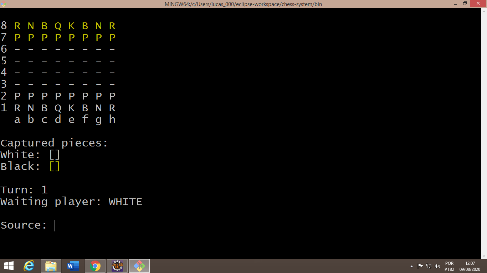

# Chess system in Java
Developed project in a course of java.
You can find this course on the platform udemy.

URL for the course: [Java COMPLETO 2020 Programação Orientada a Objetos +Projetos.](https://www.udemy.com/course/java-curso-completo/) 
Instructor: [Nelio Alves.](https://www.udemy.com/course/java-curso-completo/#instructor-1)

## :pushpin: Index
- [Design.](#tv-design)
- [Technologies used.](#computer-technologies-used)
- [Clone this project.](#open_file_folder-clone-this-project)
- [License.](#key-license)

## :tv: Design

  

## :computer: Technologies used
- Java.
- IDE - Eclipse.
- Prompt git for testing.

## :open_file_folder: Clone this project
Use this command in your GitBash `` git clone https://github.com/LeonEvil/chess-system-java.git ``

## :key: License
All files are under license [Apache License 2.0.](https://github.com/LeonEvil/chess-system-java/blob/master/LICENSE)

Developer: [Lucas Serafim.](https://github.com/LeonEvil/)
